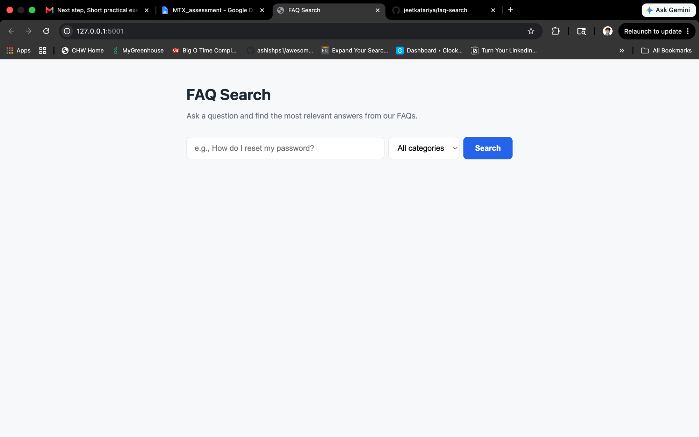
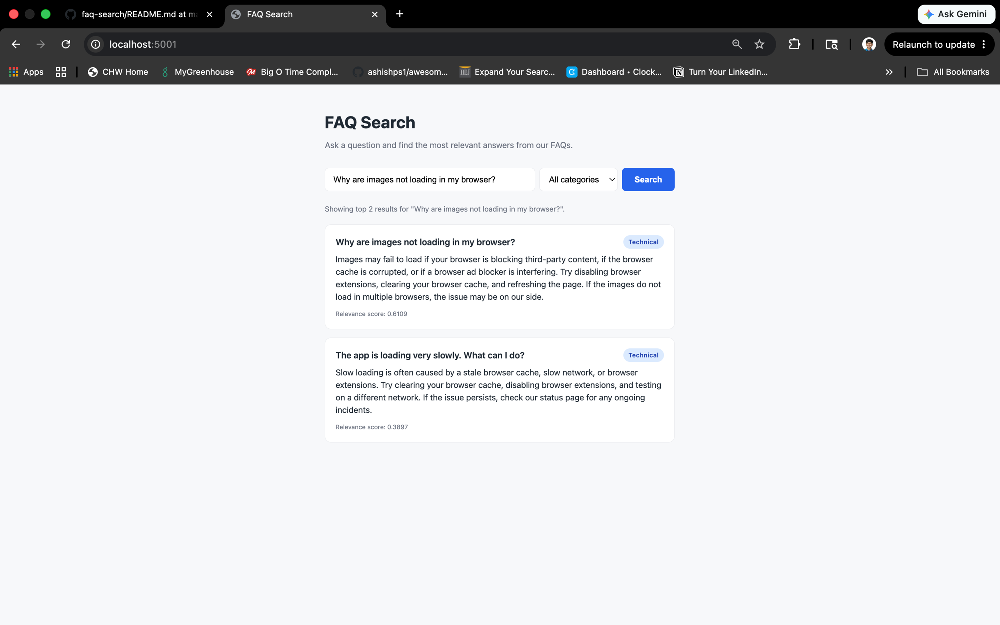

# FAQ Search


A small Flask web app that lets a user type a question and returns up to 3 matching FAQ entries, ranked by relevance using TF-IDF and cosine similarity over a local dataset (`faq.json`).

## Overview

The app loads a bundled set of 15 FAQ items (5 each in Billing, Technical, and Account categories), vectorizes them once at startup, and ranks them against a user query using cosine similarity on TF-IDF vectors. The single page submits to a JSON endpoint and renders the top 3 results above a configurable relevance threshold. An optional category dropdown narrows the search to a single category.

## How to run

**Prerequisites:** Python 3.10+ and `pip`.

```bash
# 1. Clone the repository
git clone <repo-url>
cd faq-search

# 2. (Recommended) create a virtual environment
python -m venv .venv
source .venv/bin/activate          # on Windows: .venv\Scripts\activate

# 3. Install dependencies
pip install -r requirements.txt

# 4. Start the app
python app.py
```

Then open <http://127.0.0.1:5001/> in your browser.

> **macOS note:** the app runs on port `5001` (not `5000`) because macOS AirPlay Receiver claims `5000` by default.

## How to run tests

```bash
pytest
```

This runs the six tests in `tests/test_search.py`, covering matching queries, empty/whitespace queries, the result cap (3), irrelevant queries, category filtering, and result ordering.

A GitHub Actions workflow (`.github/workflows/tests.yml`) runs the same command on every push.

You can see a passing CI run here: <https://github.com/jeetkatariya/faq-search/actions/runs/26387582940/job/77669499160>

## Search approach

The search pipeline is intentionally simple and explainable:

1. **Indexing (at startup, once).** Each FAQ is represented by the concatenation of its `question` and `answer` fields. The full corpus is fitted with `sklearn.feature_extraction.text.TfidfVectorizer` configured with:
   - `lowercase=True` — case-insensitive matching
   - `stop_words="english"` — common words like *the*, *is*, *how*, *to* are dropped so they do not inflate scores
2. **Querying.** The user query is transformed by the same vectorizer, and cosine similarity is computed against every document vector.
3. **Filtering and ranking.** Each FAQ with a similarity score `>= 0.3` is kept; the survivors are sorted by score (descending) and the top 3 are returned.
4. **No matches.** If no FAQ clears the threshold, the API returns an empty `results` array and the UI shows *"No results found. Try different keywords."*

### Why threshold `0.3`?

I tested 12 representative queries against the corpus and recorded the top score for each (see the methodology below). The pattern that emerged:

- Genuine matches consistently scored **0.35–0.65**.
- Irrelevant FAQs for the same queries clustered at **0.0–0.22**.
- A small group of legitimate, partially-overlapping queries (e.g. *"how to clear browser"*, *"cancel subscription refund"*) scored between **0.30 and 0.40**.

A threshold of `0.3` keeps that middle group while still cleanly excluding the irrelevant cluster. `0.4` was tested first but was too aggressive — it dropped three queries that a human would consider obvious matches. The threshold is a single constant (`SCORE_THRESHOLD` in `search.py`) and is easy to retune.

## Screenshots

**Initial page (before search):**



**Page after a successful search** (query: `Why are images not loading in my browser?`, no category filter — both matching Technical FAQs are shown, sorted by relevance score):



## Sample queries

Try these natural-language questions in the UI. Each one surfaces the top 3 most relevant FAQs (the cap defined in our scope) and exercises a different ranking behavior:

- `How do I cancel my subscription?` — direct question; returns 3 results spanning **Billing** and **Account** (cancel subscription, delete account, charged twice), demonstrating cross-category ranking.
- `How do I get a refund for my unused subscription?` — multi-intent question (refund + subscription); returns 3 results across **Billing** and **Account**, showing how the ranker reconciles overlapping intents.
- `Help me with my browser problem` — broader, vaguely worded query; returns 3 Technical FAQs (images not loading, supported browsers, slow loading), demonstrating recall over a single category.

## Project structure

```
faq-search/
├── app.py                       # Flask app + POST /api/search endpoint
├── search.py                    # FAQSearch class (TF-IDF + cosine)
├── faq.json                     # 15 FAQ items
├── templates/index.html         # single-page UI
├── static/style.css             # styling
├── static/app.js                # form submit + result rendering
├── tests/test_search.py         # pytest tests
├── requirements.txt
├── .github/workflows/tests.yml  # CI: runs pytest on push
└── screenshots/
```

## API

The UI calls a single JSON endpoint:

**`POST /api/search`**

Request body (category is optional):
```json
{ "query": "reset password", "category": "Account" }
```

Valid `category` values: `"Billing"`, `"Technical"`, `"Account"`. Omit the field or send an empty string to search all categories.

Successful response (`200`):
```json
{
  "query": "reset password",
  "category": null,
  "results": [
    {
      "id": 11,
      "question": "How do I reset my password?",
      "answer": "Click Forgot Password on the sign-in page...",
      "category": "Account",
      "score": 0.5424
    }
  ]
}
```

Empty / whitespace-only query (`400`):
```json
{ "error": "Please enter a search query.", "results": [] }
```

## Known limitations

- **No stemming or lemmatization.** *"refund"* and *"refunds"* are treated as different tokens. A real system would use a Snowball stemmer or lemmatizer.
- **No synonym handling.** *"sign in"* will not match *"login"*. Synonym expansion or embedding-based retrieval would fix this.
- **No typo tolerance.** *"reste password"* will likely return nothing. Fuzzy matching (e.g. RapidFuzz) or character n-grams would help.
- **English only.** The vectorizer uses English stopwords; behavior on other languages is undefined.
- **Single-process, in-memory index.** Fine for a 15-item dataset, but would need a real index (or a vector DB) at meaningful scale.
- **Threshold is a global constant.** A more sophisticated system would adapt the threshold per query length or use a relative cutoff.

## How I would upgrade this to embeddings / RAG

If this prototype graduated to handling thousands of FAQs and natural-language paraphrases, my next steps would be:

1. **Replace TF-IDF with sentence embeddings.** Use `sentence-transformers/all-MiniLM-L6-v2` to encode each FAQ once. This gives semantic matches (e.g. *"login"* → *"sign in"*) that TF-IDF cannot.
2. **Store vectors in a vector DB.** Either `pgvector` for an existing Postgres deployment, or a managed option (Pinecone, Weaviate) for scale. Index for approximate nearest neighbor (HNSW or IVF).
3. **Hybrid retrieval.** Combine BM25 (lexical) and dense vectors with a fusion step (e.g. Reciprocal Rank Fusion). This catches both keyword and semantic matches.
4. **Optional generative layer (true RAG).** Pass the top-k retrieved FAQs as context to an LLM (Claude, GPT-4) and let it synthesize a single answer with citations to the source FAQs.
5. **Eval harness.** Build a labeled set of ~200 query → expected-FAQ pairs and measure precision@1, recall@3, and MRR on every change so retrieval tuning is data-driven instead of vibe-driven.

## Hours spent

Approximately **1 hours**, including dataset curation, implementation, testing, threshold tuning, and documentation.
